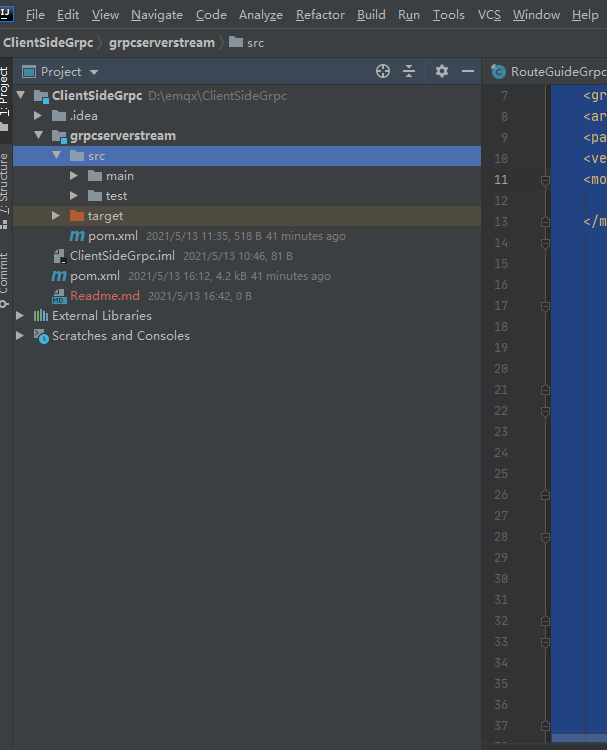
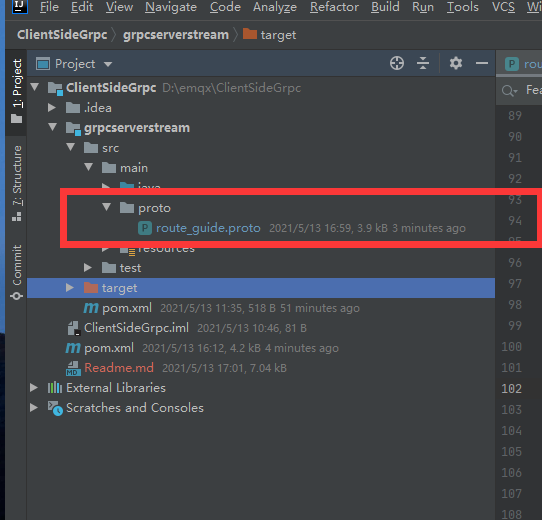
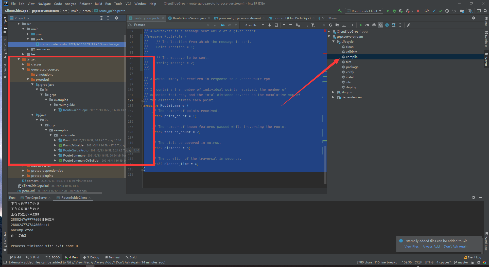
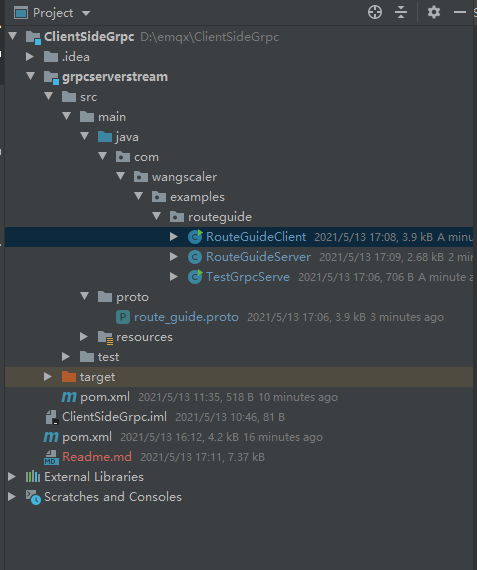
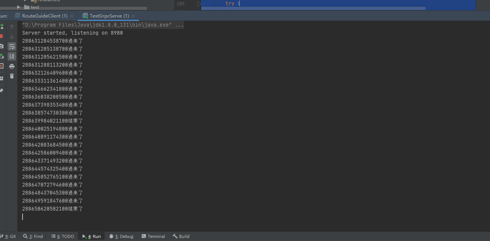
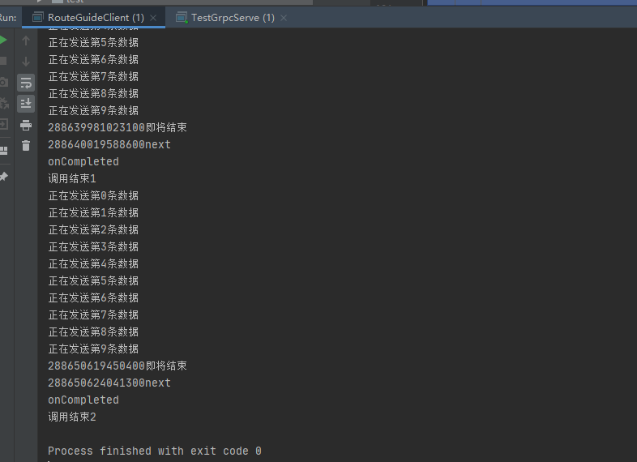

# GRPC 客户端的简易Demo

GRPC的相关知识，可参考[官方中文文档](http://doc.oschina.net/grpc?t=60134)，以下 是客户端流的搭建过程。[源码地址]https://github.com/WangScaler/CientSideGrpc()

## 1、新建Maven项目

```xml
<?xml version="1.0" encoding="UTF-8"?>
<project xmlns="http://maven.apache.org/POM/4.0.0"
         xmlns:xsi="http://www.w3.org/2001/XMLSchema-instance"
         xsi:schemaLocation="http://maven.apache.org/POM/4.0.0 http://maven.apache.org/xsd/maven-4.0.0.xsd">
    <modelVersion>4.0.0</modelVersion>

    <groupId>com.wangscaler</groupId>
    <artifactId>ClientSideGrpc</artifactId>
    <packaging>pom</packaging>
    <version>1.0-SNAPSHOT</version>
    <modules>
        <module>grpcserverstream</module>
    </modules>
        <dependencies>
            <!--使用grpc和protobuf-->
            <!-- protobuf依赖-->
            <dependency>
                <groupId>com.google.protobuf</groupId>
                <artifactId>protobuf-java</artifactId>
                <version>3.6.1</version>
            </dependency>
            <dependency>
                <groupId>com.googlecode.protobuf-java-format</groupId>
                <artifactId>protobuf-java-format</artifactId>
                <version>1.2</version>
            </dependency>
            <!--grpc依赖-->
            <dependency>
                <groupId>io.grpc</groupId>
                <artifactId>grpc-netty</artifactId>
                <version>1.11.0</version>
            </dependency>
            <dependency>
                <groupId>io.grpc</groupId>
                <artifactId>grpc-protobuf</artifactId>
                <version>1.11.0</version>
            </dependency>
            <dependency>
                <groupId>io.grpc</groupId>
                <artifactId>grpc-stub</artifactId>
                <version>1.11.0</version>
            </dependency>
            <dependency>
                <groupId>io.grpc</groupId>
                <artifactId>grpc-all</artifactId>
                <version>1.11.0</version>
            </dependency>

            <dependency>
                <groupId>io.netty</groupId>
                <artifactId>netty-all</artifactId>
                <version>4.1.22.Final</version>
            </dependency>
            <dependency>
                <groupId>com.google.api.grpc</groupId>
                <artifactId>proto-google-common-protos</artifactId>
                <version>1.0.0</version>
            </dependency>
            <!-- https://mvnrepository.com/artifact/javax.annotation/javax.annotation-api -->
            <dependency>
                <groupId>javax.annotation</groupId>
                <artifactId>javax.annotation-api</artifactId>
                <version>1.3.2</version>
            </dependency>

        </dependencies>

        <build>
            <extensions>
                <extension>
                    <groupId>kr.motd.maven</groupId>
                    <artifactId>os-maven-plugin</artifactId>
                    <version>1.4.1.Final</version>
                </extension>
            </extensions>
            <plugins>
                <plugin>
                    <groupId>org.xolstice.maven.plugins</groupId>
                    <artifactId>protobuf-maven-plugin</artifactId>
                    <version>0.5.0</version>
                    <configuration>
                        <protocArtifact>com.google.protobuf:protoc:3.3.0:exe:${os.detected.classifier}</protocArtifact>
                        <pluginId>grpc-java</pluginId>
                        <pluginArtifact>io.grpc:protoc-gen-grpc-java:1.4.0:exe:${os.detected.classifier}</pluginArtifact>
                    </configuration>
                    <executions>
                        <execution>
                            <goals>
                                <goal>compile</goal>
                                <goal>compile-custom</goal>
                            </goals>
                        </execution>
                    </executions>
                </plugin>
                <plugin>
                    <groupId>org.apache.maven.plugins</groupId>
                    <artifactId>maven-compiler-plugin</artifactId>
                    <configuration>
                        <source>8</source>
                        <target>8</target>
                    </configuration>
                </plugin>
            </plugins>
        </build>

    </project>
```

此处项目代码用了Module，本来想客户端和服务器端分开写的，后来写在了一块。如何新建Module，自己去查

结构示意图



## 2、编写proto文件

在main下创建proto文件夹,并新建文件route_guide.proto。内容如下

```protobuf
// Copyright 2015 The gRPC Authors
//
// Licensed under the Apache License, Version 2.0 (the "License");
// you may not use this file except in compliance with the License.
// You may obtain a copy of the License at
//
//     http://www.apache.org/licenses/LICENSE-2.0
//
// Unless required by applicable law or agreed to in writing, software
// distributed under the License is distributed on an "AS IS" BASIS,
// WITHOUT WARRANTIES OR CONDITIONS OF ANY KIND, either express or implied.
// See the License for the specific language governing permissions and
// limitations under the License.
syntax = "proto3";

option java_multiple_files = true;
option java_package = "com.wangscaler.examples.routeguide";
option java_outer_classname = "RouteGuideProto";
option objc_class_prefix = "RTG";

package routeguide;

// Interface exported by the server.
service RouteGuide {

    // A client-to-server streaming RPC.
    //
    // Accepts a stream of Points on a route being traversed, returning a
    // RouteSummary when traversal is completed.
    rpc RecordRoute(stream Point) returns (RouteSummary) {}
}

// Points are represented as latitude-longitude pairs in the E7 representation
// (degrees multiplied by 10**7 and rounded to the nearest integer).
// Latitudes should be in the range +/- 90 degrees and longitude should be in
// the range +/- 180 degrees (inclusive).
message Point {
    int32 latitude = 1;
    int32 longitude = 2;
}

// A RouteSummary is received in response to a RecordRoute rpc.
//
// It contains the number of individual points received, the number of
// detected features, and the total distance covered as the cumulative sum of
// the distance between each point.
message RouteSummary {
    // The number of points received.
    int32 point_count = 1;

    // The number of known features passed while traversing the route.
    int32 feature_count = 2;

    // The distance covered in metres.
    int32 distance = 3;

    // The duration of the traversal in seconds.
    int32 elapsed_time = 4;
}

```

文件夹示意图



## 3、使用maven编译生成代码



## 4、编写服务器端

在java文件夹下创建目录com.wangscaler.examples.routeguide,并编写server端代码

```java
/*
 * Copyright 2015 The gRPC Authors
 *
 * Licensed under the Apache License, Version 2.0 (the "License");
 * you may not use this file except in compliance with the License.
 * You may obtain a copy of the License at
 *
 *     http://www.apache.org/licenses/LICENSE-2.0
 *
 * Unless required by applicable law or agreed to in writing, software
 * distributed under the License is distributed on an "AS IS" BASIS,
 * WITHOUT WARRANTIES OR CONDITIONS OF ANY KIND, either express or implied.
 * See the License for the specific language governing permissions and
 * limitations under the License.
 */

package com.wangscaler.examples.routeguide;
import static java.util.concurrent.TimeUnit.NANOSECONDS;

import com.wangscaler.examples.routeguide.Point;
import com.wangscaler.examples.routeguide.RouteGuideGrpc;
import com.wangscaler.examples.routeguide.RouteSummary;
import io.grpc.stub.StreamObserver;
import java.util.logging.Level;
import java.util.logging.Logger;


public class RouteGuideServer {
    private static final Logger logger = Logger.getLogger(RouteGuideServer.class.getName());

    public static class RouteGuideService extends RouteGuideGrpc.RouteGuideImplBase {
        @Override
        public StreamObserver<Point> recordRoute(final StreamObserver<RouteSummary> responseObserver) {
            return new StreamObserver<Point>() {
                int pointCount;
                int featureCount;
                int distance;
                Point previous;
                final long startTime = System.nanoTime();

                @Override
                public void onNext(Point point) {
                    System.out.println(System.nanoTime()+"进来了");
                    pointCount++;
                    previous = point;
                }

                @Override
                public void onError(Throwable t) {
                    System.out.println(t.getMessage());
                    System.out.println(t.getCause());
                    System.out.println("error");
                    logger.log(Level.WARNING, "recordRoute cancelled");
                }

                @Override
                public void onCompleted() {
                    System.out.println(System.nanoTime()+"结束了");
                    long seconds = NANOSECONDS.toSeconds(System.nanoTime() - startTime);
                    responseObserver.onNext(RouteSummary.newBuilder().setPointCount(pointCount)
                            .setFeatureCount(featureCount).setDistance(distance)
                            .setElapsedTime((int) seconds).build());
                    responseObserver.onCompleted();
                }
            };
        }
    }
}
```

## 5、编写启动server

```java
package com.wangscaler.examples.routeguide;

import io.grpc.Server;
import io.grpc.netty.NettyServerBuilder;

public class TestGrpcServe {
    public static void main(String[] args) throws Exception {
        int port = 8980;
        Server server = NettyServerBuilder.forPort(port)
                .addService(new RouteGuideServer.RouteGuideService())
                .build()
                .start();
        System.out.println("Server started, listening on " + port);
        server.awaitTermination();
        Runtime.getRuntime().addShutdownHook(new Thread() {
            @Override
            public void run() {
                System.out.println("Server Stop");
            }
        });
    }
}
```

## 6、编写客户端

```java
/*
 * Copyright 2015 The gRPC Authors
 *
 * Licensed under the Apache License, Version 2.0 (the "License");
 * you may not use this file except in compliance with the License.
 * You may obtain a copy of the License at
 *
 *     http://www.apache.org/licenses/LICENSE-2.0
 *
 * Unless required by applicable law or agreed to in writing, software
 * distributed under the License is distributed on an "AS IS" BASIS,
 * WITHOUT WARRANTIES OR CONDITIONS OF ANY KIND, either express or implied.
 * See the License for the specific language governing permissions and
 * limitations under the License.
 */

package com.wangscaler.examples.routeguide;

import io.grpc.Channel;
import io.grpc.ManagedChannel;
import io.grpc.ManagedChannelBuilder;
import io.grpc.stub.StreamObserver;

import java.util.Random;
import java.util.concurrent.CountDownLatch;
import java.util.concurrent.TimeUnit;


/**
 * Sample client code that makes gRPC calls to the server.
 */
public class RouteGuideClient {

    private final RouteGuideGrpc.RouteGuideStub asyncStub;

    private Random random = new Random();

    /**
     * Construct client for accessing RouteGuide server using the existing channel.
     */
    public RouteGuideClient(Channel channel) {
        asyncStub = RouteGuideGrpc.newStub(channel);
    }


    /**
     * Async client-streaming example. Sends {@code numPoints} randomly chosen points from {@code
     * features} with a variable delay in between. Prints the statistics when they are sent from the
     * server.
     */
    public void recordRoute(int numPoints) throws InterruptedException {
        final CountDownLatch finishLatch = new CountDownLatch(1);
        StreamObserver<RouteSummary> responseObserver = new StreamObserver<RouteSummary>() {
            @Override
            public void onNext(RouteSummary summary) {
                System.out.println(System.nanoTime()+"next");
            }

            //
            @Override
            public void onError(Throwable t) {
                System.out.println("onError");
                finishLatch.countDown();
            }

            @Override
            public void onCompleted() {
                System.out.println("onCompleted");
                finishLatch.countDown();
            }
        };

        StreamObserver<Point> requestObserver = asyncStub.recordRoute(responseObserver);
        try {
            for (int i = 0; i < numPoints; ++i) {
                Point point = Point.newBuilder().setLatitude(11).setLongitude(12).build();
                System.out.println("正在发送第" + i + "条数据");
                requestObserver.onNext(point);
                Thread.sleep(random.nextInt(1000) + 500);
                if (finishLatch.getCount() == 0) {
                    return;
                }
            }
        } catch (RuntimeException e) {
            requestObserver.onError(e);
            throw e;
        }
        // Mark the end of requests
        System.out.println(System.nanoTime()+"即将结束");
        requestObserver.onCompleted();

        // Receiving happens asynchronously
        if (!finishLatch.await(5, TimeUnit.SECONDS)) {
            System.out.println("recordRoute can not finish within 1 minutes");
        }
    }

    /**
     * Issues several different requests and then exits.
     */
    public static void main(String[] args) throws InterruptedException {
        String target = "localhost:8980";
        ManagedChannel channel = ManagedChannelBuilder.forTarget(target).usePlaintext().build();
        RouteGuideClient client = new RouteGuideClient(channel);
        try {

            client.recordRoute(10);
        } finally {
            System.out.println("调用结束1");
            client.recordRoute(10);
            System.out.println("调用结束2");
            channel.shutdownNow().awaitTermination(5, TimeUnit.SECONDS);
        }
    }
}
```

文件示意图



## 启动

启动完服务器端，再启动客户端。程序正常运行，服务器端收到客户端的调用



